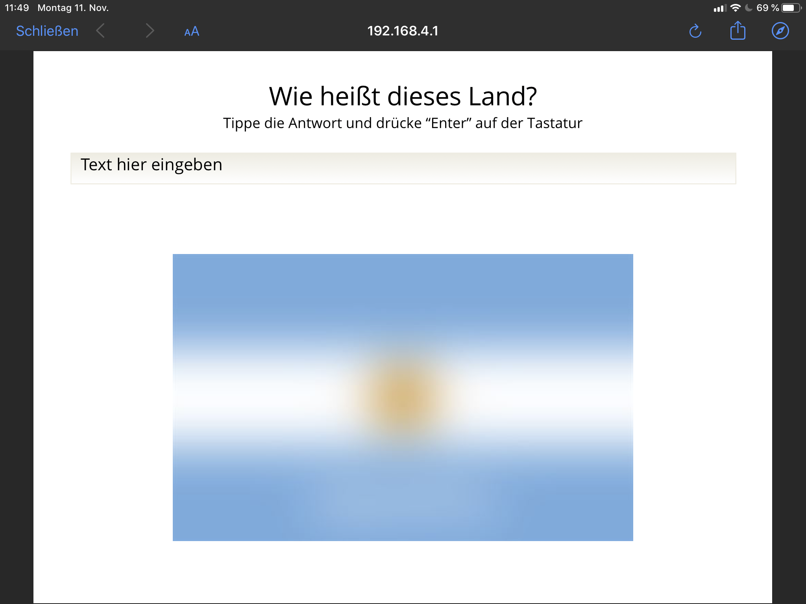
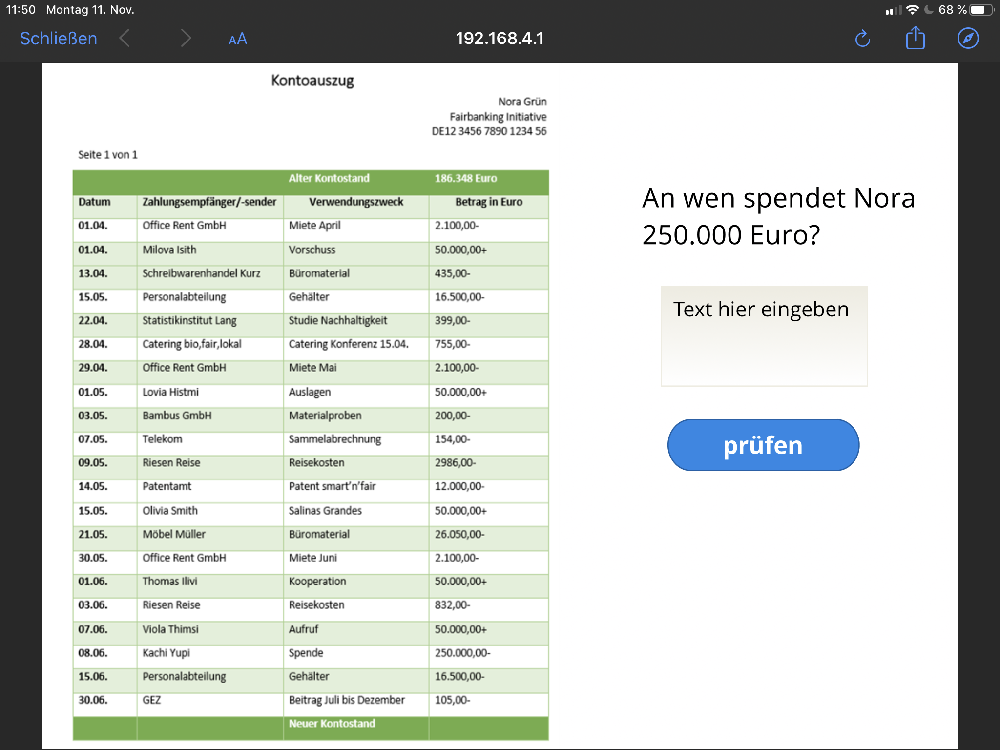

# Handbuch Konsumkrimi -

### erstellt vom Referat Entwicklung & Politik und von Christian Pfliegel (E-Learning-Entwicklung bei Mission EineWelt).

SchülerInnen ab der 7. Klasse und KonfirmandInnen suchen mit Hilfe von Tablets nach den Ursachen für das Verschwinden von Nora Grün,
einer Unternehmerin, die ein faires und nachhaltiges Smartphone auf den Markt bringen will.
Beim Lösen verschiedener Aufgaben, beim Knacken von Rätseln und Codes stoßen die SchülerInnen auf die
meist menschenunwürdigen Abbau- und Produktionsbedingungen sowie umweltzerstörende Praktiken in der Handy-Produktion in Ländern wie
Argentinien, DR Kongo, Indonesien, China, Peru. Aber auch auf Initiativen, ArbeiterInnen, Genossenschaften u.a.,
die sich für faire und umweltschonende Bedingungen einsetzen.

## Die Geschichte

Sie war drauf und dran, der neue Star des Öko-Business zu werden. Doch jetzt ist Nora Grün, Geschäftsführerin des Start-ups Smart’n’Fair,
wie es scheint, über Nacht verschwunden. Die 28-Jährige verfolgte seit Jahren zusammen mit ihrem Team und unzähligen UnterstützerInnen die
Idee, ein möglichst fair hergestelltes Smartphone auf den Markt zu bringen. Die Recherche nach Unternehmen, die ihre strengen Vorgaben
in Sachen Arbeitsbedingungen, Bezahlung der Mitarbeitenden und Umweltschutz erfüllen können, führte Nora Grün rund um die Welt.
Ihr Einsatz brachte ihr jedoch nicht nur viel Be- wunderung und eine wachsende Fangemeinde ein. Es gab auch viele, die ihr den
Erfolg nicht gönnten. Wüste Drohungen waren genauso an der Tagesordnung wie Versuche, ihr Unternehmen kaputt zu machen.

## Inhaltverzeichnis

## Inventarliste

### Hardware
- [ ] 1x Raspberry Pi
- [ ] Netzteil Raspberry Pi
- [ ] SD-Karte 16 GB (Im Raspberry Pi)

### Allgemein
- [ ] Weltkarte
- [ ] Karten mit QR-Codes (2x)
- [ ] Handysammelbox

### Station Argentinien
- [ ] Akku mit QR-Code 19
- [ ] 49 bunte Holzplättechen "Kachi Yupi"

### Station Indonesien
- [ ] Zettel mit Koordinaten Indonesien
- [ ] Holzbox mit Zahlenschloss
- [ ] Legespiel + Anleitung

### Station China
- [ ] Handy mit Hinweisen im Akkufach
- [ ] Zeitungsausschnitt

### Station Ghana
- [ ] Kinokarte mit QR-Code 11
- [ ] Beschreibung 3D-Labyrinth
- [ ] Text in 3D-Labyrinth (1x Extra)
- [ ] 3D-Labyrinth (2x)
- [ ] Lösung 3D-Labyrinth

## Aufbau: Übersicht
1. Raspberry Pi in die Steckdose stecken (muss im gleichen Raum sein)
2. "Kachi Yupi"-Spiel legen (49 Holzplättchen)
3. Weltkarte darüber legen
4. 6 Geräte per Wlan mit dem Raspberry verbinden
5. Handy-Sammelbox beliebig im Raum aufstellen und 3-D-Labyrinth darunter legen
6. Verschlossenes Kästchen unter den Tisch mit der Weltkarte stellen
7. Zeitungsartikel im Raum aufhängen
8. Rucksack im Raum aufstellen
9. Plakate mit QR-Codes aufhängen
10. Intro-Film auf Beamer vorbereiten (befindet sich auf dem USB-Stick)

---

## Wichtig:
* Die Technik des Konsumkrimis ist nicht kompliziert! Dennoch ist es wichtig, dass die einzelnen Schritte in der richten Reihenfolge eingehalten werden!

## Räumliche Voraussetzungen:
* Beamer mit Lautsprechern
* großer Tisch
* Bewegungsfreiheit im Raum

---

## Schritt 1: Raspberry Pi einstecken
Der Raspberry Pi wird einfach in die Steckdose gesteckt

---
## Wichtig:
* Der Startvorgang dauert etwa eine Minute. Vorher können keine Geräte verbunden werden
* Der Raspberry Pi sollte nicht hinter Möbel oder sonstigen Gegenständen liegen, um das Wlan nicht zu stören
* Die Reichweite ist für ein normales Klassenzimmer oder einen Seminarraum locker ausreichend
---

## Schritt 2: Kachi Yupi legen
Die 49 bunten Holzplättchen folgendermaßen auf einen Tisch gelegt (dies ist das Logo der NGO Kachi Yupi):

---
## Wichtig:
* Der Tisch muss so groß sein, dass die Weltkarte Platz hat
* Der Tisch sollte von allen Seiten zugänglich sein und relativ zentral stehen
* Die Holzplättchen müssen mit dem Text nach unten gelegt werden
---

## Schritt 3: Weltkarte
Die Weltkarte wird auf die Holzplättchen gelegt

## Schritt 4: Ipads (oder andere Geräte) verbinden
Die Ipads (oder andere wlan-fähige Geräte) werden mit dem Raspberry Pi verbunden. Dafür sind folgende Schritte notwendig:
* Wlan am Gerät einschalten
* Folgendes Netzwerk suchen: RPi3
* mit diesem Netzwerk verbinden
* **Passwort: Schermen138!**

---
## Wichtig:
* Für die Nutzung des Konsumkrimis ist für die TeilnehmerInnen keinen Internetverbindung notwendig. Alle Inhalte liegen auf dem Raspberry Pi.
* Jedes Gerät, das über Wlan verfügt, kann mit dem Raspberry Pi verbunden werden (Tablet, Smartphone). Eine Installation einer App ist nicht notwendig, die Inhalte werden über den Browser angezeigt.
* Um die Inhalte abrufen zu können ist ein QR-Code-Scanner auf dem Gerät notwendig. Bitte informieren sie sich, wie ein solcher auf Ihre Geräte kommt. Bei neueren iOS-Geräten (Apple) und auch bei neueren Android-Geräten (Google) kann häufig die Kamera-App QR-Codes lesen. Ansonsten ist die Installation über die Appstores notwendig (QR-Code-Scanner können dort kostenlos geladen werden).
* Insgesamt sind für die Durchführung sechs Geräte notwendig, die mit dem Raspberry Pi verbunden werden.
* Auf Grund des größeren Bildschirms werden Tablets empfohlen, aber auch die Nutzung von Handys ist möglich.
* Fall die Teilnehmer*innen ihre eigenen Geräte verwenden sollen diese vorab informieren, dass ein QR-Code-Scanner auf den Geräten notwendig ist (ansonsten bedarf es keiner zustätzlichen Software/ Apps)
---

## Schritt 5: Handysammelbox aufstellen
Die Handysammelbox wird irgendwo im Raum aufgestellt, so dass sie auf den zweiten Blick sichtbar ist. Unter die Sammelbox werden die 3D-Labyrinthe sowie die Anleitung für diese gelegt. Eine Lösung der Labyrinthe liegt bei, falls TeilnehmerInnen es nicht schaffen, diese Aufgabe zu lö- sen. Auf der Unterseite der 3D-Labyrinthe ist der Bolzen mit einem schwarzen Punkt markiert, so dass die Lösung verwendet werden kann (siehe Foto unten)

## Schritt 6: Holzkästchen aufstellen
Das mit dem Schloss versperrte Kästchen wird unter den Tisch mit der Weltkarte gestellt.
**Der Code des Schlosses ist 101 (wird während des Krimis erspielt)**

## Schritt 7: Zeitungsartikel im Raum aufhängen
Der Zeitungsartikel wird so im Raum aufgehängt, dass er nach kurzen Umsehen leicht gefunden werden kann.

## Schritt 8: Rucksack im Raum aufstellen
Der Rucksack wird in der Nähe der Weltkarte aufgestellt, so dass er leicht gesehen werden kann. Im Rucksack finden sich 6 Gegenstände (für jeden Gruppe einer). Auf jedem Gegenstand findet sich die Nummer des Start-QR- Codes (teilweise versteckt, als Aufgabe verpackt). Zudem finden sich im Rucksack Stifte + Notizblöcke, die bei Bedarf von den TeilnehmerInnen verwendet werden können.

## Schritt 9: QR-Codes aufhängen

Die beiden Plakate mit den QR-Codes werden gut zugänglich an einer Tafel oder Wand aufgehängt.

## Schritt 10: Intro-Film vorbereiten
Der Intro-Film findet sich auf dem beigelegten USB-Stick und sollte über einen Beamer gezeigt werden.

---
## Wichtig:
* Der Film ist vertont, deshalb sind Lautsprecher am Beamer notwendig!
---

## Übersicht: Ablauf

### Erste Hinführung zum Thema: Umfrage:
Umfrage: Wie viele Handys hattest du schon?

### Einführungsspiel: 
Weltverteilung (siehe Seite xxx)

### Video: Wo ist Nora Grün? 
= Video auf USB-Stick

### Arbeit in Gruppen
6 Gruppen bearbeiten 6 Stationen (2 Stationen sind doppelt)
* **Station 1**: Argentinien, Thema: Lithium
* **Station 2**: Indonesien, Thema: Zinn
* **Station 3**: Ghana, Thema: Elektroschrott
* **Station 4**: China, Thema: Rechte von Arbeitnehmer*innen

### Ergebnisse sammeln
Jede Gruppe erzählt den anderen Gruppen im Plenum, was sie herausgefunden hat

### Gemeinsame Abschluss-Aufgabe
= Ordner auf USB-Stick

### Abschluss: Wie beeinflusst dein Konsum die Welt
www.mission-learning.org/formular_neu (siehe Seite xxx)

## Erste Hinführung zum Thema
Für den Einstieg in die Einheit bietet es sich an, die Gruppe in das Thema einzuführen.
Dabei hat sich folgendes Vorgehen bewährt:
* **1. Einstiegsfrage: Wie viele Handys hattest du schon?**: 
* Aufgabe: Gruppiert euch nach Anzahl der Handys, die ihr schon bessen habt (1 Gruppe mit TeilnehmerInnen, die bisher 1 Handy hatten, 1 Gruppe mit TeilnehmerInnen, die zwei Handys hatten usw.
* **2. Einstiegsfrage: Welche Rohstoffe kennt ihr, die in Handys verbaut sind**
* Aufgabe: Infos hierzu können den Hintergrundinfos in diesem Handbuch entnommen werden.

## Einführungsspiel: Weltverteilung
www.mission-einwelt.de

# Beschreibung der Stationen

## Argentinien
* Einstieg: Akku mit Code 19
* Aufgabe 1: Land gesucht! Lösung: Argentinien
* 
* Code 3 (klebt auf Argentinien)
* Aufgabe 2: Kontoauszug! Lösung 1: Kachi Yupi, Lösung 2: 137 (Olivia Smith oder eine andere Spenderin, die 50.000 gegeben hat)
* 
* 
* Code 137
* Text: Synonyme von Olivia Smith
* Code 22
* Text: Infos zu Kachi Yupi
* Legespiel mit Holzplättchen (unter der Weltkarte)
* Code 20
* Text: Brief
* Code 29
* Puzzle: Erpresserbrief
* 

## Indonesien
* Einstieg: Zettel mit Koordinaten. Lösung: Bangka und Belitung (indonesiche Inseln), mit 10 beschriftet
* Code 10 (muss gescannt werden und dann in der 1. Aufgabe eingegeben werden).
* 1. Aufgabe: Zu welchem Land gehören die Inseln? Lösung: Indonesien
* 2. Aufgabe: Welche Stadt liegt nordwestlich? Lösung: Singapur (Süd-Nord sind auf der Karte vertauscht!)
* 3. Aufgabe: Hauptstadt? Lösung: Jakarta
* Abschließende Aufgabe. Was ist gesucht? Lösung: Kassiterit
* Code 17 (klebt auf Deutschland) Matheaufgabe zu Kassiterit. Lösung: 1
* Code 1
* Zahlenschloss knacken. Lösung: 101 
* Domino, Lösung: 117 
* Code 117
* Pressemitteilung

## Ghana
* Einstieg: Kinokarte mit Code 11: interaktiver Kinofilm (Welcome to Sodom) 
* Code 167
* Lebenslauf Handy. Lösung 1: Lösung 2: letzte Zeile anklicken
* Code 148
* Text: Recherche
* Brief unter der Sammelbox, 3D-Labyrinth 
* Code 164
* Brief von Don

## China
* Einstieg: Handy mit Hinweis in Akkufach 
* Code 13
* Rebus. Lösung: Leewou Group
* Aufgabe: Zeitung im Raum finden Zeitung. 
* Code 83 => Lösungen: 160 Euro, 6 Tage, Foxconn
* Lösung: Ausbeutung (= Code 131) 
* Code 131
* interaktiver Film. Lösungen: China oder Indien, Siemens, Alles richtig außer Wenig Urlaub, falsch, 
* Code 184
* Labyrinth, Lösung: China Labour Watch Undercover
