# Handbuch Konsumkrimi -

### erstellt vom Referat Entwicklung & Politik und von Christian Pfliegel (E-Learning-Entwicklung bei Mission EineWelt).

Schüler:innen ab der 7. Klasse und Konfirmand:innen suchen mit Hilfe von Tablets nach den Ursachen für das Verschwinden von Nora Grün,
einer Unternehmerin, die ein faires und nachhaltiges Smartphone auf den Markt bringen will.
Beim Lösen verschiedener Aufgaben, beim Knacken von Rätseln und Codes stoßen die Schüler:innen auf die
meist menschenunwürdigen Abbau- und Produktionsbedingungen sowie umweltzerstörende Praktiken in der Handy-Produktion in Ländern wie Argentinien, DR Kongo, Indonesien, China, Peru. Aber auch auf Initiativen, Arbeiter:innen, Genossenschaften u.a., die sich für faire und umweltschonende Bedingungen einsetzen.

# Methode und Grundlagen
* Die digitalen Aufgaben liegen auf dem Raspberry Pi, eine Internetverbindung ist nicht notwendig. Die Daten verlassen den Raum nicht (DSGVO!)
* Die Schüler:innen bearbeiten in 6 Gruppen 4 verschiedene Länder, zwei Stationen sind doppelt. Jede Gruppe hat dabei die folgende Aufträge: Schreibt das Land auf, um das es geht. Welche Probleme gibt es in diesem Land wegen der Mobiltelefone? Wie könnte die Situation verbessert werden?
* Die nummerierten QR-Codes führen durch die Geschichte, Ziel ist es immer, den nächsten QR-Code zu erarbeiten
* Die QR-Codes werden mit einem QR-Reader gelesen, die Aufgabe öffnet sich dann im Browser

## Lehrziele
* Die Teilnehmer:innen können Rohstoffe benennen, die in einem Smartphone verbaut sind.
* Die Teilnehmer:innen können drei Ländern benennen, aus denen diese Rohstoffe stammen.
* Die Teilnehmer:innen können drei problematische Aspekte der Smartphone-Nutzung benennen.
* Die Teilnehmer:innen können drei Möglichkeiten benennen, wie diese Probleme verbessert werden könnten.
* Die Teilehmer:innen reflektieren ihr eigenes Konsumverhalten.

## Die Geschichte
Sie war drauf und dran, der neue Star des Öko-Business zu werden. Doch jetzt ist Nora Grün, Geschäftsführerin des Start-ups Smart’n’Fair, wie es scheint, über Nacht verschwunden. Die 28-Jährige verfolgte seit Jahren zusammen mit ihrem Team und unzähligen Unterstützer:innen die Idee, ein möglichst fair hergestelltes Smartphone auf den Markt zu bringen. Die Recherche nach Unternehmen, die ihre strengen Vorgaben in Sachen Arbeitsbedingungen, Bezahlung der Mitarbeitenden und Umweltschutz erfüllen können, führte Nora Grün rund um die Welt.

Ihr Einsatz brachte ihr jedoch nicht nur viel Bewunderung und eine wachsende Fangemeinde ein. Es gab auch viele, die ihr den Erfolg nicht gönnten. Wüste Drohungen waren genauso an der Tagesordnung wie Versuche, ihr Unternehmen kaputt zu machen.

## Inventarliste

Folgende Teile sind enthalten: 

### Hardware
- [ ] 1x Raspberry Pi
- [ ] Netzteil Raspberry Pi
- [ ] SD-Karte 16 GB (Im Raspberry Pi)

### Allgemein
- [ ] Weltkarte
- [ ] Karten mit QR-Codes (2x)
- [ ] Stoffbeutel - Handyaktion
- [ ] Handbuch Konsumkrimi
- [ ] Anleitung Weltverteilungsspiel (= optionaler Einstieg)
- [ ] Anleitung: Privilegiencheck (= optionaler Einstieg)
- [ ] USB-Stick
- [ ] Rucksack (enthält: Akku, Postkarte (2x), Handy, Kinokarte (2x), Stifte + Papier).

### Station Argentinien
- [ ] Akku mit QR-Code 19 (im Rucksack)
- [ ] 49 bunte Holzplättechen "Kachi Yupi"

### Station Indonesien (2x enthalten)
- [ ] Postkarte mit Arbeitsauftrag (im Rucksack)
- [ ] Holzbox mit Zahlenschloss
- [ ] Legespiel + Anleitung (in der Holzbox)

### Station China
- [ ] Handy mit Hinweisen im Akkufach (im Rucksack)
- [ ] Zeitungsausschnitt

### Station Ghana(2x enthalten)
- [ ] Kinokarte mit QR-Code 11 (im Rucksack)
- [ ] Text in 3D-Labyrinth (steck 1x in der Lösung)
- [ ] 3D-Labyrinth (2x)
- [ ] Lösungsweg 3D-Labyrinth

## Aufbau: Übersicht
1. Raspberry Pi in die Steckdose stecken (muss im gleichen Raum sein)
2. "Kachi Yupi"-Spiel legen (49 Holzplättchen)
3. Weltkarte darüber legen
4. 6 Geräte per Wlan mit dem Raspberry verbinden
5. 3D-Labyrinthe in die Stoffbeutel packen und diese irgendwo im Raum aufhängen
6. Verschlossene Kästchen irgendwo sichtbar im Raum aufstellen
7. Zeitungsartikel im Raum aufhängen
8. Rucksack im Raum aufstellen
9. Plakate mit QR-Codes aufhängen
10. Intro-Film auf Beamer vorbereiten (befindet sich auf dem USB-Stick)

---

## Wichtig:
* Die Technik des Konsumkrimis ist nicht kompliziert! Dennoch ist es wichtig, dass die einzelnen Schritte in der richten Reihenfolge eingehalten werden!

## Voraussetzungen:
* Beamer mit Lautsprechern
* großer Tisch
* Bewegungsfreiheit im Raum
* 6 wlan-fähige Endgeräte (Tablet, Smartphone, Ipad)

---

## Schritt 1: Raspberry Pi einstecken
Der Raspberry Pi wird einfach in die Steckdose gesteckt

---
## Wichtig:
* Der Startvorgang dauert etwa eine Minute. Vorher können keine Geräte verbunden werden
* Der Raspberry Pi sollte nicht hinter Möbel oder sonstigen Gegenständen liegen, um das Wlan nicht zu stören
* Die Reichweite ist für ein normales Klassenzimmer oder einen Seminarraum locker ausreichend
---

## Schritt 2: Kachi Yupi legen
Die 49 bunten Holzplättchen folgendermaßen auf einen Tisch gelegt (dies ist das Logo der NGO Kachi Yupi):

---
## Wichtig:
* Der Tisch muss so groß sein, dass die Weltkarte Platz hat
* Der Tisch sollte von allen Seiten zugänglich sein und relativ zentral stehen
* Die Holzplättchen müssen mit dem Text nach unten gelegt werden
---

## Schritt 3: Weltkarte
Die Weltkarte wird auf die Holzplättchen gelegt

## Schritt 4: Ipads (oder andere Geräte) verbinden
Die Ipads (oder andere wlan-fähige Geräte) werden mit dem Raspberry Pi verbunden. Dafür sind folgende Schritte notwendig:
* Wlan am Gerät einschalten
* Folgendes Netzwerk suchen: RPi3
* mit diesem Netzwerk verbinden
* **Passwort: Schermen138!**

---
## Wichtig:
* Für die Nutzung des Konsumkrimis ist für die TeilnehmerInnen keinen Internetverbindung notwendig. Alle Inhalte liegen auf dem Raspberry Pi.
* Jedes Gerät, das über Wlan verfügt, kann mit dem Raspberry Pi verbunden werden (Tablet, Smartphone). Eine Installation einer App ist nicht notwendig, die Inhalte werden über den Browser angezeigt.
* Um die Inhalte abrufen zu können ist ein QR-Code-Scanner auf dem Gerät notwendig. Bitte informieren sie sich, wie ein solcher auf Ihre Geräte kommt. Bei neueren iOS-Geräten (Apple) und auch bei neueren Android-Geräten (Google) kann häufig die Kamera-App QR-Codes lesen. Ansonsten ist die Installation über die Appstores notwendig (QR-Code-Scanner können dort kostenlos geladen werden).
* Insgesamt sind für die Durchführung sechs Geräte notwendig, die mit dem Raspberry Pi verbunden werden.
* Auf Grund des größeren Bildschirms werden Tablets empfohlen, aber auch die Nutzung von Handys ist möglich.
* Fall die Teilnehmer*innen ihre eigenen Geräte verwenden sollen diese vorab informieren, dass ein QR-Code-Scanner auf den Geräten notwendig ist (ansonsten bedarf es keiner zustätzlichen Software/ Apps)
---

## Schritt 5: Stoffbeutel "Handyaktion" aufhängen
Die Stoffbeutel werden irgendwo im Raum aufgehängt, so dass sie auf den zweiten Blick sichtbar ist.  Bei den 3D-Labyrinthen ist der Bolzen mit einem schwarzen Punkt markiert, so dass die beigelegte Lösung verwendet werden kann. Der Punkt ist sichtbar, wenn das Labyrinth von unten angeschaut wird.

## Schritt 6: Holzkästchen aufstellen
Das mit dem Schloss versperrte Kästchen wird im Raum aufgestellt
**Der Code des Schlosses ist 101 (wird während des Krimis erspielt)**

## Schritt 7: Zeitungsartikel im Raum aufhängen
Der Zeitungsartikel wird so im Raum aufgehängt, dass er nach kurzen Umsehen leicht gefunden werden kann.

## Schritt 8: Rucksack im Raum aufstellen
Der Rucksack wird in der Nähe der Weltkarte aufgestellt, so dass er leicht gesehen werden kann. Im Rucksack finden sich 6 Gegenstände (für jeden Gruppe einer). Auf jedem Gegenstand findet sich die Nummer des Start-QR- Codes (teilweise versteckt, als Aufgabe verpackt). Zudem finden sich im Rucksack Stifte + Notizblöcke, die bei Bedarf von den TeilnehmerInnen verwendet werden können.

## Schritt 9: QR-Codes aufhängen

Die beiden Plakate mit den QR-Codes werden gut zugänglich an einer Tafel oder Wand aufgehängt.

## Schritt 10: Intro-Film vorbereiten
Der Intro-Film findet sich auf dem beigelegten USB-Stick und sollte über einen Beamer gezeigt werden.

---
## Wichtig:
* Der Film ist vertont, deshalb sind Lautsprecher am Beamer notwendig!
---

## Übersicht: Ablauf

### Erste Hinführung zum Thema: Umfrage:
Umfrage: Wie viele Handys hattest du schon?

### Einführungsspiel:
Weltverteilung (Anleitung siehe Beiblatt) ODER Privilegien-Check (Anleitung siehe Beiblatt)

### Video: Wo ist Nora Grün?
= Video auf USB-Stick, über Beamer zeigen!

### Arbeit in Gruppen
6 Gruppen bearbeiten 6 Stationen (Ghana und Indonesien sind doppelt), die Start-QR-Codes finden sie auf den Gegenständen im Rucksack
* **Station 1**: Argentinien, Thema: Lithium
* **Station 2**: Indonesien, Thema: Zinn
* **Station 3**: Ghana, Thema: Elektroschrott
* **Station 4**: China, Thema: Rechte von Arbeitnehmer*innen

### Ergebnisse sammeln
Jede Gruppe erzählt den anderen Gruppen im Plenum, was sie herausgefunden hat

### Gemeinsame Abschluss-Aufgabe
= Ordner "Schluss" auf USB-Stick öffnen und die Datei "hier_klicken.html" öffnen. Über Beamer zeigen!

### Abschluss: Wie beeinflusst dein Konsum die Welt
www.mission-learning.org/formular_neu ... Webseite über Beamer öffnen. Mit dieser Seite kann der Konsum an Handys bis zum 80. Geburtstag hochgerechnet werden (mit dem Schieberegler muss das Alter, das Jahr des 1. Smartphones und die Anzahl der bisherigen Handys eingegebn werden). Mit dem unteren
Schieberegler kann die Ersparnis bei einer längeren durchschnittlichen Nutzung kalkuliert werden.

## Erste Hinführung zum Thema
Für den Einstieg in die Einheit bietet es sich an, die Gruppe in das Thema einzuführen.
Dabei hat sich folgendes Vorgehen bewährt:
* **1. Einstiegsfrage: Wie viele Handys hattest du schon?**:
* Aufgabe: Gruppiert euch nach Anzahl der Handys, die ihr schon bessen habt (1 Gruppe mit TeilnehmerInnen, die bisher 1 Handy hatten, 1 Gruppe mit TeilnehmerInnen, die zwei Handys hatten usw.
* **2. Einstiegsfrage: Welche Rohstoffe kennt ihr, die in Handys verbaut sind**
* Aufgabe: Infos hierzu können den Hintergrundinfos in diesem Handbuch entnommen werden.

## Einführungsspiel: Weltverteilung oder Privilegien-Check (beides optional und nicht Teil des Konsumkrimis)
Anleitungen und Beschreibungen sind dem Paket beigelegt

# Übersicht: Reihenfolge QR-Codes
Die QR-Codes sollen in der folgenden Reihenfolge gescannt werden (die ausführlichere Lösung findet sich weiter unten):

## Argentinien
19 => 3 => 137 => 22 => 20 => 29

## Indonesien
10 => 17 => 1 => 117

## Ghana
11 => 167 => 148 => 164

## China
13 => 83 => 131 => 184

# Beschreibung der Stationen

## Argentinien
* Einstieg: Akku mit Code 19
* Aufgabe 1: Land gesucht! Lösung: Argentinien
* 
* Code 3 (Nummer befindet sich auf Argentinien)
* Aufgabe 2: Kontoauszug! Lösung: Kachi Yupi
* 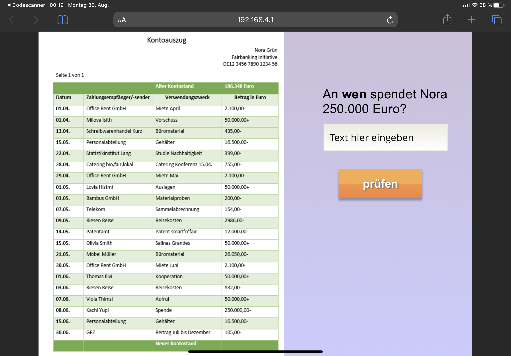
* Aufgabe 2: Kontoauszug 2. Lösung: 137 (Olivia Smith oder eine andere Spenderin, die 50.000 gegeben hat)
* 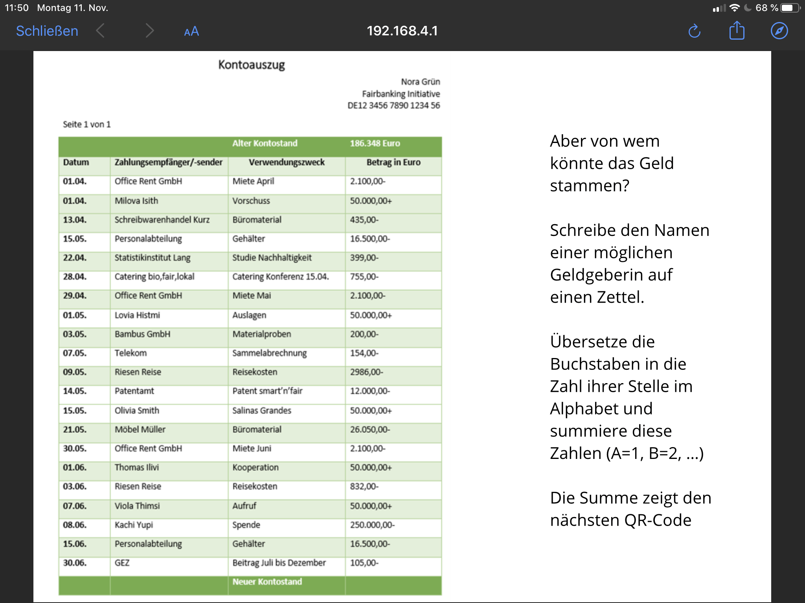
* Code 137
* Text: Synonyme von Olivia Smith
* Code 22
* Text: Infos zu Kachi Yupi
* Legespiel mit Holzplättchen (unter der Weltkarte)
* Code 20
* Text: Brief
* Code 29
* Puzzle: Erpresserbrief
* 

## Indonesien
* Einstieg: Postkarte mit der Anweisung, Code 10 zu scannen
* Code 10
* Aufgabe: Wo steht die 10 ... Lösung: Das linke Bild
* 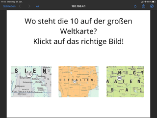
* Aufgabe: Wo sind die Inseln zu finden? Lösung: im rechten Drittel in der Mitte
* 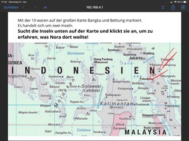
* Aufgabe: Zu welchem Land gehören die Inseln? Lösung: Indonesien
* 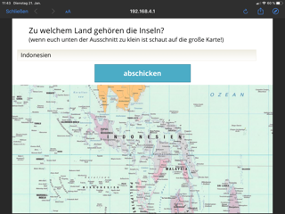
* Aufgabe: Hauptstadt? Lösung: Jakarta
* 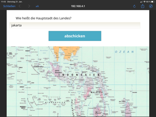
* Aufgabe: Welche Stadt liegt nordwestlich? Lösung: Singapur (Süd-Nord sind auf der Karte vertauscht!)
* 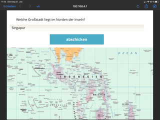
* Abschließende Aufgabe. Was ist gesucht? Lösung: Kassiterit
* 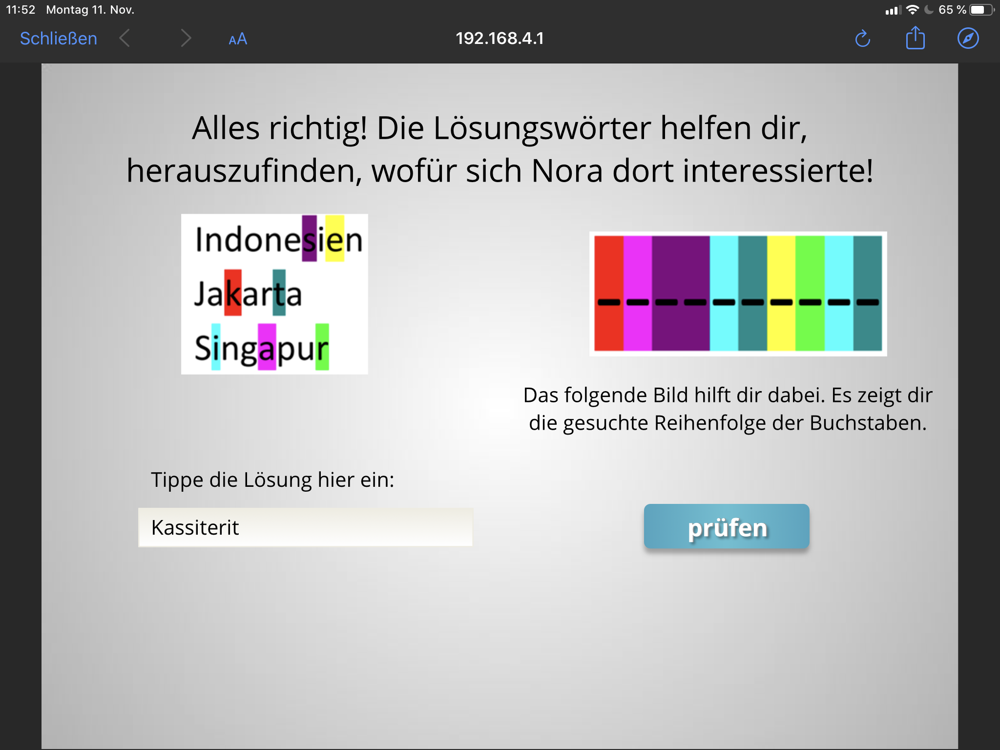
* Code 17 (Nummer befindet sich auf Deutschland) Matheaufgabe zu Kassiterit. Lösung: 1
* 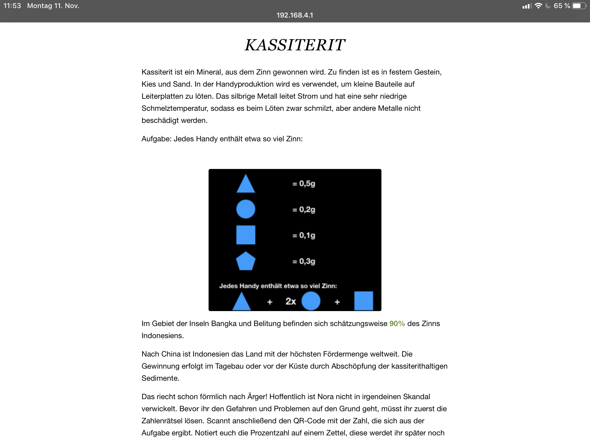
* Code 1
* Zahlenschloss knacken. Lösung: 101
* Domino, Lösung: 117 (Auf der Rückseite der Karte mit dem Text "Regenwaldabholzung")
* Code 117
* Pressemitteilung

## Ghana
* Einstieg: Kinokarte mit Code 11: interaktiver Kinofilm (Welcome to Sodom). Lösungen: Shakespeare, Agbogbloshie, vier-stellig, Mercedes Benz, Gomorra, Ghana, Accra
* Code 167
* Lebenslauf Handy. Lösung:
* 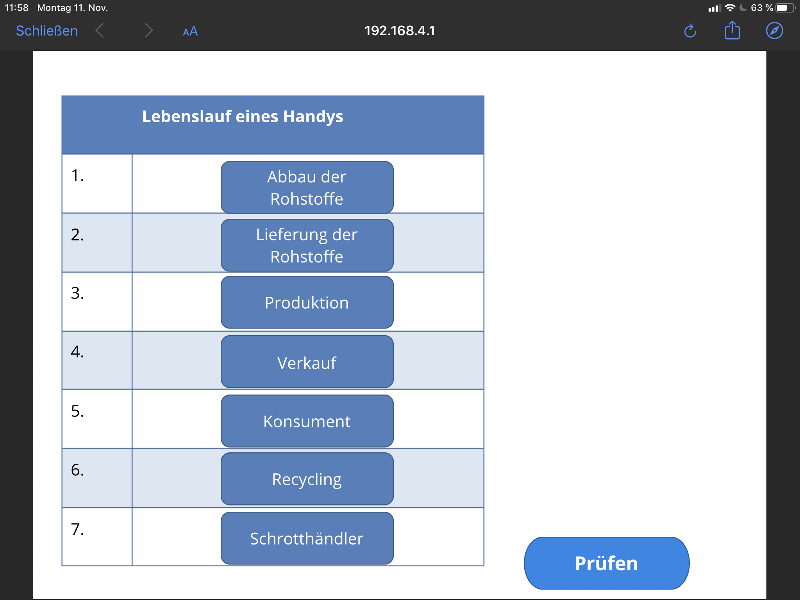
* Lösung 2: letzte Zeile anklicken
* 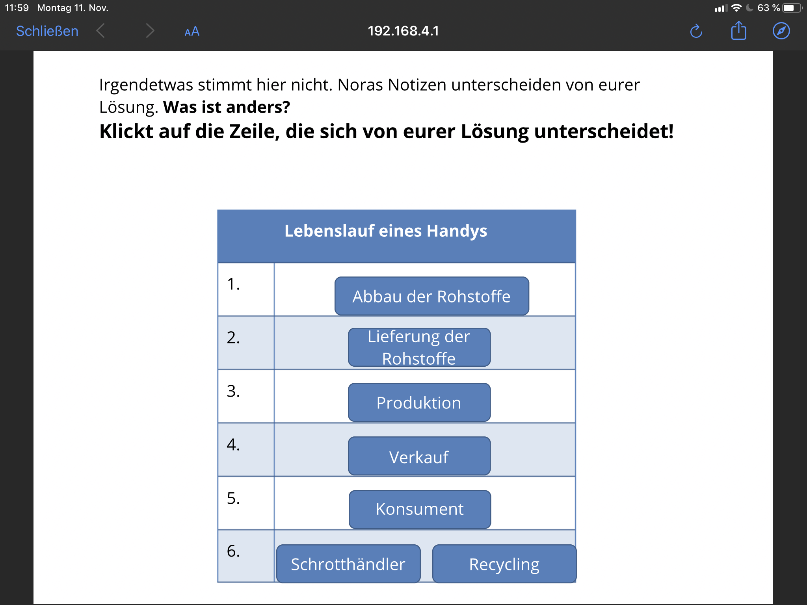
* Code 148
* Text: Recherche
* 3D-Labyrinth im Stoffbeutel Handyaktion
* Code 164
* Brief von Don

## China
* Einstieg: Handy mit Hinweis in Akkufach
* Code 13 (befindet sich auf China)
* Rebus. Lösung: Leewou Group:
* 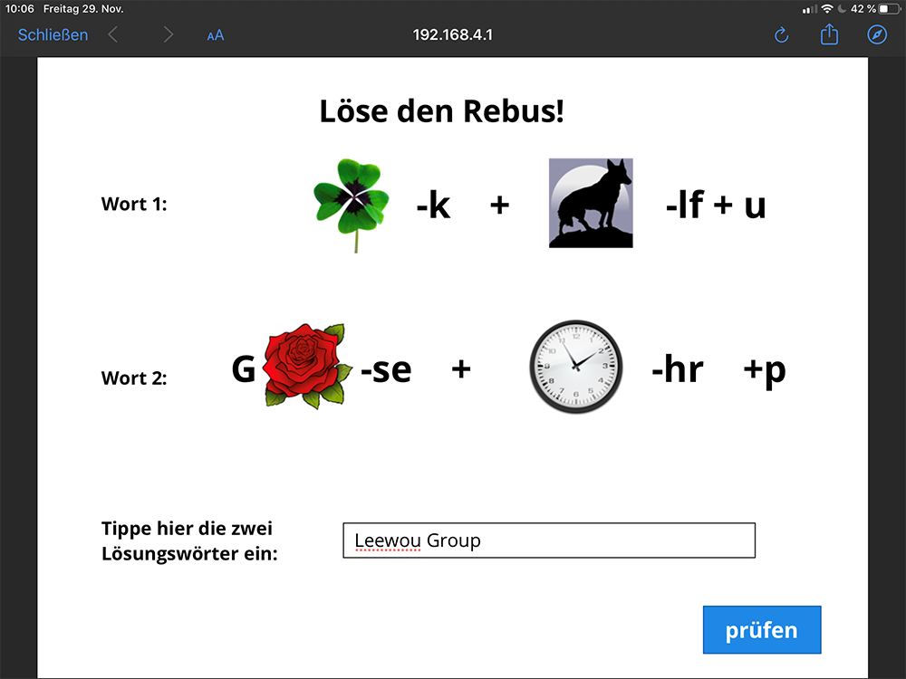
* Aufgabe: Zeitung im Raum finden Zeitung.
* Code 83 => Lösungen: 160 Euro, 6 Tage, Foxconn:
* 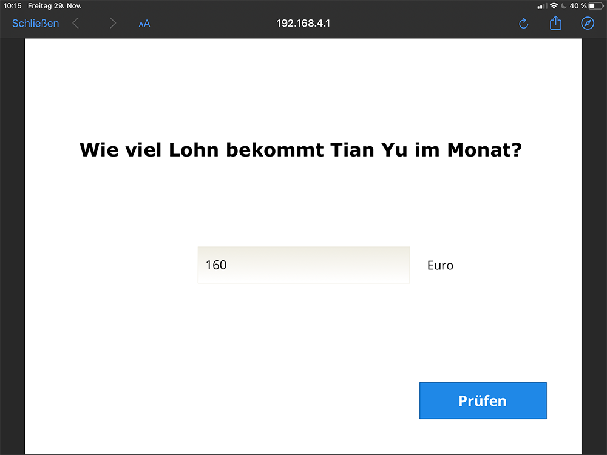
* 
* 
* Lösung: Ausbeutung (= Code 131)
* Code 131
* interaktiver Film. Lösungen: China oder Indien, Siemens, Alles richtig außer Wenig Urlaub, falsch,
* Code 184
* Labyrinth, Lösung: China Labour Watch Undercover
* 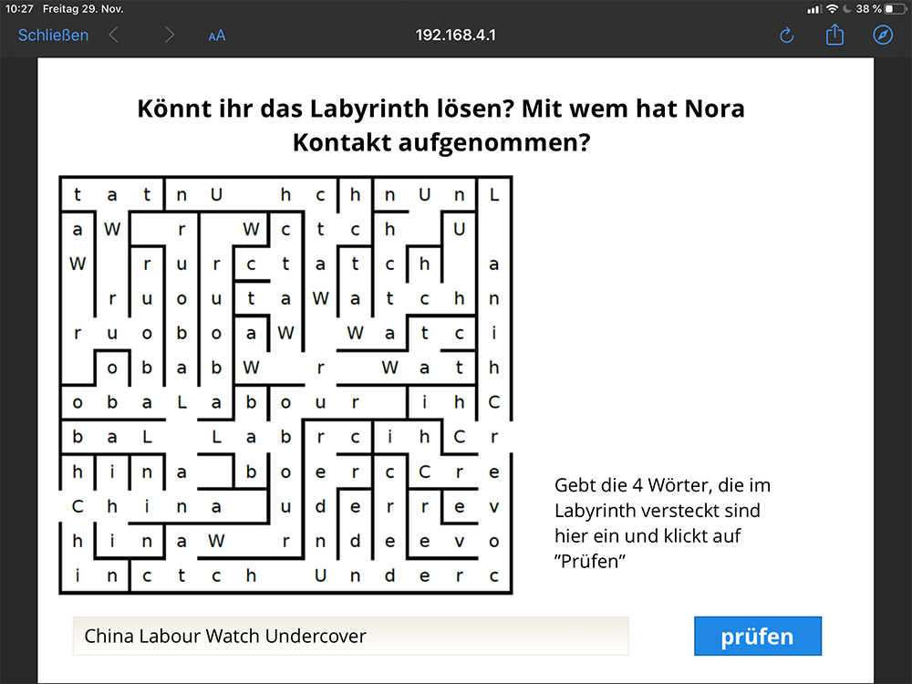

## Schluss-Station
Lösung:
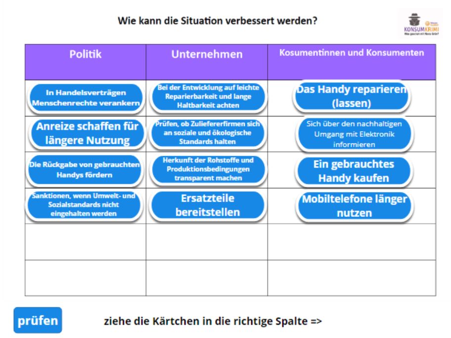

## Abschluss
Seite: www.mission-learning.org/formular_neu öffnen

Vielen Dank und viel Spaß beim Spielen!
